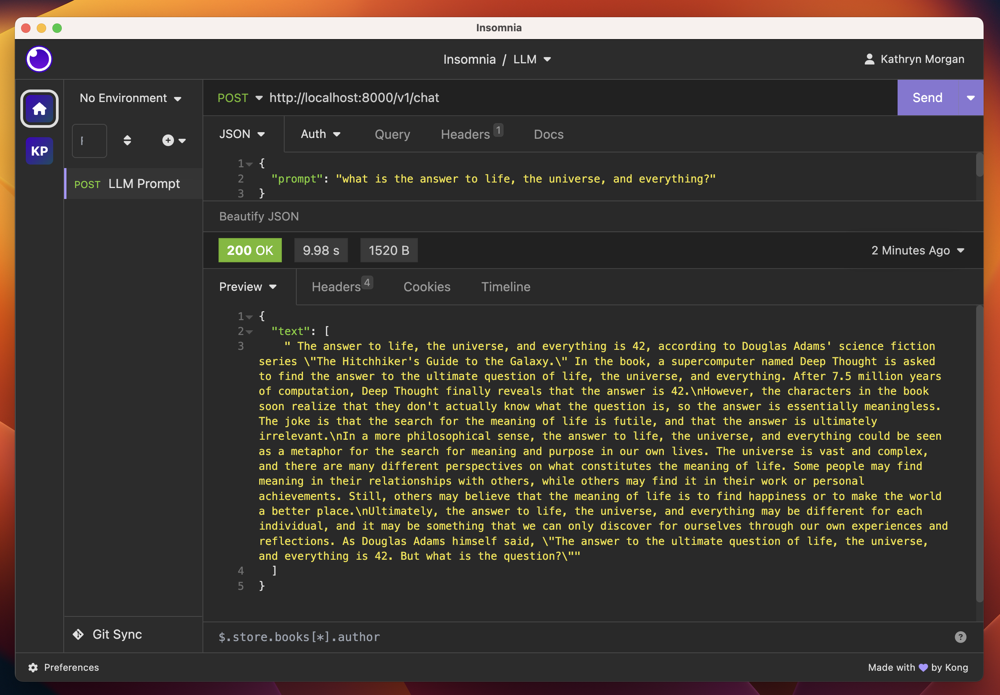

# KatWalk Server - LLM API Server and IaC

> This repository is under construction.    
> Encouragement and or Bugs & PRs for enhancement are welcome!

## About:

Katwalk is an llm model api server.    
In this repository you will find all code required to build a containerized LLM API service and deploy.

## Deployment options:
- Locally with Docker
- Runpod.io GPU Cloud (alpha)
- Azure on ACI*
- More to come

> Azure ACI containers take ~90 minutes to start for un-diagnosed reasons

## Limitations: 

- Katwalk server is a PoC project only at this time.
- Tested to run `hf` models from huggingface only.
- Platform: `linux/amd64` only at this time.
- Requires CUDA support.

## Navigate to the [./pulumi](./pulumi) directory for instructions 



# Configuration Index
```yaml
# secret encryption salt
encryptionsalt: v1:Ce8NM940=:v1:j+XGC73Zqp:t34XyjytvHcK+G1luA==
config:

  #################################################################
  # General Deploy config
  #################################################################
  # Usage Keys:
  #   Keys:
  #     - pulumi config set <key> <value>
  #   Secret Keys:
  #     - pulumi config set --secret <secret_key> <secret_value>

  katwalk:deploy: "True" # Default: False, set to "True" to deploy
  katwalk:runtime: "runpod" # Default: docker, accepts: docker, runpod, azure
  katwalk:deploymentName: "katwalk" # Defaults to "katwalk"

  #################################################################
  # Docker Image Settings
  #################################################################

  # Docker Build & Push Settings
  katwalk:dockerBuild: "False" # Default: False, set to "True" to build container
  katwalk:dockerPush: "False" # Default: False, set to "True" to push container

  # Docker Image Name & Registry Settings
  katwalk:dockerTag: "20230829"
  katwalk:dockerName: "katwalk"
  katwalk:dockerProject: "usrbinkat" # Optional if same as dockerUser
  katwalk:dockerRegistry: "ghcr.io" # accepts: any oci registry service (e.g. ghcr.io, docker.io, etc.)

  # Registry Credentials
  katwalk:dockerUser: "usrbinkat"

  # Optional unless pushing to registry or deploying to Azure
  katwalk:dockerRegistrySecret: # accepts: oci registry api token or password as `pulumi config set --secret dockerRegistrySecret <token>`
    secure: v1:UUt+00x+9Tz1:IVMKQ/2J+5ydq5R/kuFlfp+v5yYDF8HcL3Vy9Vz8nTNKPU=

  #################################################################
  # Huggingface Settings
  #################################################################

  # Huggingface Model ID string
  katwalk:hfModel: "meta-llama/Llama-2-7b-chat-hf" # accepts: any `hf` format Huggingface model ID

  # Huggingface Credentials
  katwalk:hfUser: "usrbinkat" # accepts: Huggingface user name
  katwalk:hfToken: # accepts: Huggingface API auth token as `pulumi config set --secret hfToken <token>`
    secure: v1:5hwLBQ4KO:/DNzuZ7UfbMMOQGxF7d29a+nWm04YSspPDm11y79E=

  #################################################################
  # Docker Deploy Settings
  #################################################################

  # If deploying locally via Docker
  # Default: create & use docker volume
  # Optional: set global local host path to models directory
  katwalk:modelsPath: /home/kat/models

  #################################################################
  # Azure Deploy Settings
  #################################################################

  katwalk:azureAciGpu: "V100" # accepts: V100, K80, P100
  katwalk:azureAciGpuCount: "1" # accepts: 1, 2, 4, 8

  #################################################################
  # Runpod Deploy Settings
  #################################################################

  # Runpod GPU Type
  # List of available GPU types in ./doc/runpod/README.md
  katwalk:runpodGpuType: "NVIDIA RTX A6000" # accepts: any valid Runpod GPU type

  # Runpod Credentials
  katwalk:runpodToken:
    secure: v1:2IqzPVRePwRwz:KbJzp+5L+khtSBbgW6FjPpdCQszP700xJAZVcrg/qBoo/pbgK=

```

# What's Next?
- Adding an API Gateway service?
- Adding vector database support?
- Add support for more types of models?
- https://vercel.com/templates/ai
- https://github.com/mckaywrigley/chatbot-ui
- https://medium.com/microsoftazure/custom-chatgpt-with-azure-openai-9bee437ef733
- [Container from scratch](https://docs.nvidia.com/cuda/cuda-installation-guide-linux/index.html#package-manager-installation)?

# ADDITIONAL RESOURCES:
- https://towardsdatascience.com/vllm-pagedattention-for-24x-faster-llm-inference-fdfb1b80f83
- https://kaitchup.substack.com
- https://hamel.dev
- https://github.com/michaelthwan/llm_family_chart/blob/master/2023_LLMfamily.drawio.png
- https://kaiokendev.github.io/context
